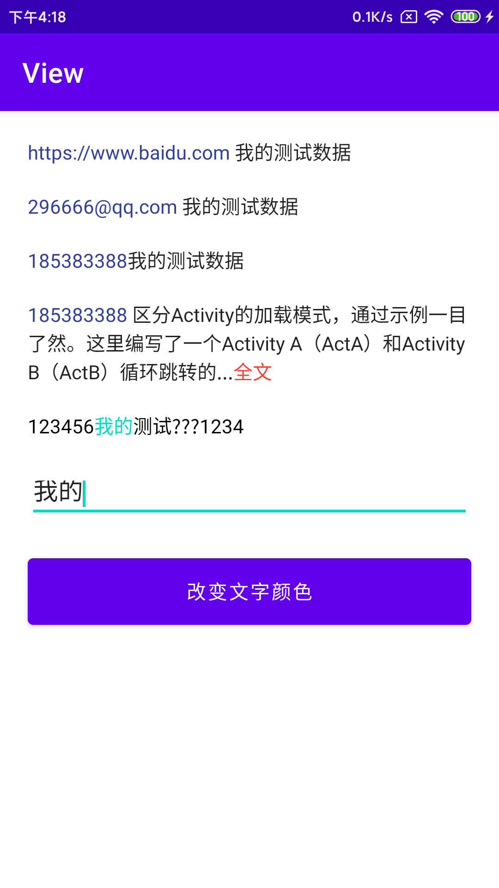

## 介绍
  日常项目中很多时候会用到TextView的高亮展示,然而原生的TextView或多或少会有点不能满足

 
#### 功能
* 网址高亮
* 手机号高亮
* 指定文字高亮
* 文字展开收缩
 
#### 引用

步骤一: 项目的 build.gradle 添加
```
allprojects {
		repositories {
			...
			maven { url 'https://jitpack.io' }
		}
	}

```
步骤一: App的 build.gradle 添加
```
//网络引用
mplementation 'com.github.wukuiqing49:textview:1.0.1'
// 本地引用
implementation project(path: ':lib_view')
  
```

 

#### 效果
<p>

</p>


#### 效果

##### 1.高亮展示网址
```
<com.wu.view.AutoLinkTextView
        android:layout_marginTop="20dp"
        android:layout_marginRight="20dp"
        android:layout_marginLeft="20dp"
        android:layout_width="match_parent"
        android:layout_height="wrap_content"
        app:useLongClick="true"
        android:text="https://www.baidu.com 我的测试数据"
        tools:ignore="MissingConstraints" />
```
##### 2.高亮展示邮箱
```
<com.wu.view.AutoLinkTextView
        android:layout_marginTop="20dp"
        android:layout_marginRight="20dp"
        android:layout_marginLeft="20dp"
        android:layout_width="match_parent"
        android:layout_height="wrap_content"
        app:useLongClick="true"
        android:text="296666@qq.com 我的测试数据"
        tools:ignore="MissingConstraints" />
```

##### 3.高亮展示手机号
```
<com.wu.view.AutoLinkTextView
        android:layout_marginTop="20dp"
        android:layout_marginRight="20dp"
        android:layout_marginLeft="20dp"
        android:layout_width="match_parent"
        android:layout_height="wrap_content"
        app:useLongClick="true"
        android:text="296666@qq.com 我的测试数据"
        tools:ignore="MissingConstraints" />
```
##### 4.缩放展示文字
```
    <com.wu.view.ExpandableTextView
        android:layout_marginTop="20dp"
        android:layout_marginRight="20dp"
        android:layout_marginLeft="20dp"
        android:layout_width="match_parent"
        app:maxCollapsedLength="80"
        app:new_collapseHint="收起"
        app:new_expandHint="全文"
        app:new_hintColor="@color/color_text_high_color"
        android:layout_height="wrap_content"
        android:text="185383388 区分Activity的加载模式，通过示例一目了然。这里编写了一个Activity A（ActA）和Activity B（ActB）循环跳转的例子。对加载模式修改和代码做稍微改动，就可以说明四种模式的区别"
        tools:ignore="MissingConstraints" />
```

##### 5.高亮展示指定文字(setTextSpan())
```
 <com.wu.view.ColorTextView
        android:layout_marginTop="20dp"
        android:layout_marginRight="20dp"
        android:layout_marginLeft="20dp"
        android:id="@+id/tv_color"
        android:layout_width="match_parent"
        android:layout_height="wrap_content"
        android:text="123456我的测试???1234"
        app:color_high_light_text_color="@color/teal_200"
        app:color_text_color="@color/black"/>
```


